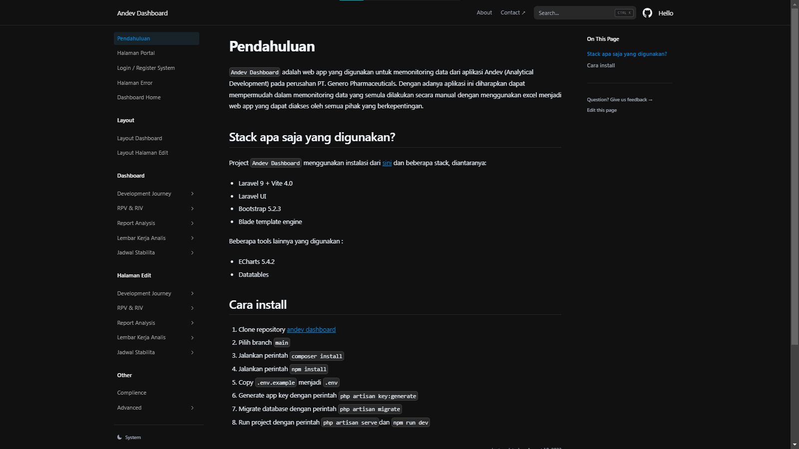

## About Andev Dashboard

Andev dashboard adalah web apps yang dibuat untuk memudahkan pengguna dalam mengelola data-data yang ada di dalam database. Andev dashboard dibuat dengan menggunakan framework Laravel UI versi 4 dengan laravel versi 9 dan bootstrap 5.

## Dokumentasi

Dokumentasi lengkap Andev Dashboard dapat dilihat pada link berikut [Andev Dashboard](https://docs-andev-genero.vercel.app)

